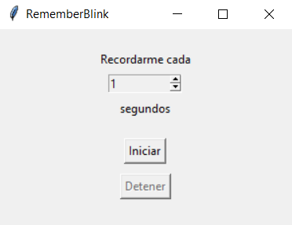
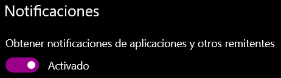
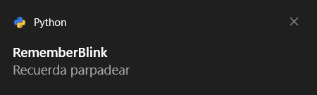
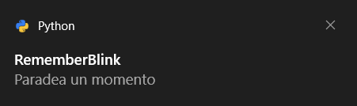
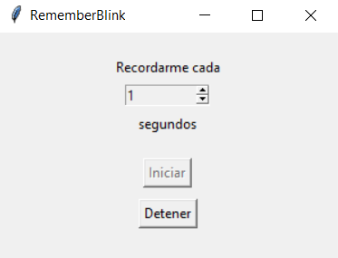

# RememberBlink
Developing is super cool, but from time to time you have to blink, don't worry, you just have to indicate how often it should remind you.

Note: This project was only tested on windows, in case you want to try with another operating system I can't guarantee that it will work :(

# Process
- Download and install Python 3.8
- Install the requirements
- Run the file rememberblink.py
- Reminders will start!!!

# Turn on your notifications
First you must verify that you have windows notifications activated, as seen in the image

# Reminders from time to time
You will receive your reminders along with your favorite notifications and the messages may vary

# You can pause your reminders
You can pause, change the frequency and start again whenever you like, you have control

## Credits
This project would not be possible without:
- https://www.python.org/
- https://pypi.org/project/schedule/
- https://pypi.org/project/win10toast/
